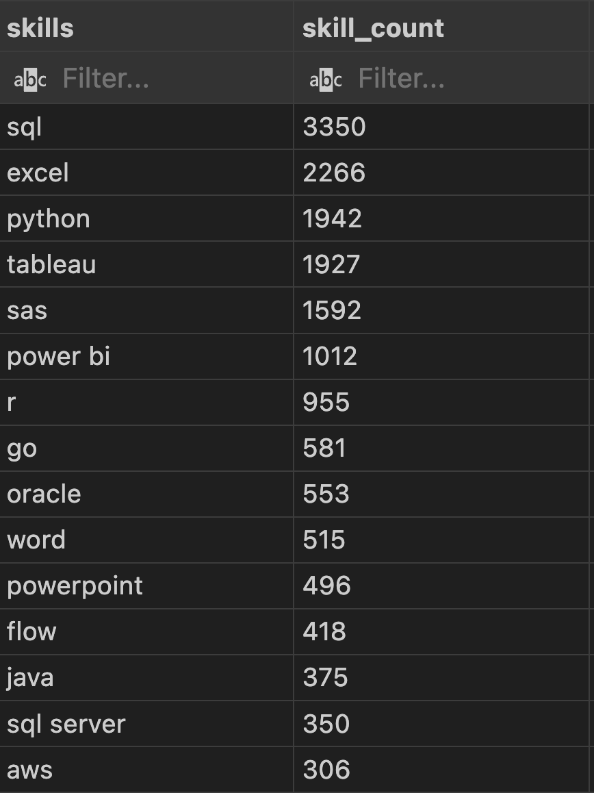

# Introduction

In this document, I will go over an analysis I did as part of Luke Barousse's SQL course. 

The course is accessible here: [Luke Barousse SQL Course](https://www.lukebarousse.com/sql)

This analysis project showcases my mastery of SQL query-writing, Markdown, and managing Github Repositories.

# Background

In this project, my objective was to identify trends among the top 10 firms that are hiring Data Analysts within the United States. I organized this analysis into 5 queries:

1. What are the top 10 businesses located in the U.S. hiring Data Analysts by the number of jobs posted?
2. What is the distribution of Work From Home (WFH) jobs versus In-person jobs among these 10 firms by job count?
3. What is the average salary for Data Analyst roles by Top 10 company?  
4. What are the top 15 demanded skills by total count of mentions across jobs posted by the Top 10 businesses?
5. Finally, are the top demanded skills different by experience level (Junior/Entry, Lead/Manager, Senior, and Unspecified)?

The job dataset provided for this project originates from Luke Barousse's datanerd.tech app, which helps budding data professionals identify the most in-demand skills by data profession. 

More info about the source data can be accessed here: [datanerd.tech](https://datanerd.tech/About)

# Tools Used

* 📁 PostgreSQL: Open-source SQL database management software (RDBMS) used to store project data and run SQL queries

* ⌨️ VSCode: Used for writing and saving project SQL queries

* ☁️ Github: Cloud-based project storage and file management

* 📊 Tableau: Used for project query visualization outside of tablular results

# Analysis Process

## Query 1: Identifying the Top 10 U.S. Companies by jobs posted

```sql
-- Query 1: What are the top 10 hiring firms for Data Analysts in the US? 

SELECT 
    company_dim.company_id, 
    company_dim.name, 
    COUNT(job_postings_fact.job_id) AS job_count
FROM job_postings_fact
LEFT JOIN company_dim ON job_postings_fact.company_id = company_dim.company_id
WHERE 
    job_title_short ILIKE '%Data_Analyst%' AND
    job_country = 'United States'
GROUP BY company_dim.company_id, company_dim.name
ORDER BY job_count DESC
LIMIT 10;
```
### Query 1 Result


### 💡 Query 1 Insights

The top 10 companies hiring in the U.S. include recruitment companies, banks, and insurance companies. 

## Query 2: Top Company jobs by WFH Policy

```sql
-- Opening CTE for top 10 analyst companies in US
WITH top_US_companies AS (
    SELECT 
        company_dim.company_id,
        company_dim.name AS company_name
    FROM job_postings_fact
    LEFT JOIN company_dim ON job_postings_fact.company_id = company_dim.company_id
    WHERE 
        job_title_short ILIKE '%Data_Analyst%' AND
        job_country = 'United States'
    GROUP BY company_dim.company_id, company_dim.name
    ORDER BY COUNT(job_postings_fact.job_id) DESC
    LIMIT 10
)

-- Query 2: What is the distribution of top company jobs by WFH policy?
SELECT 
    top_US_companies.company_name,
    job_postings_fact.job_work_from_home,
    COUNT(job_postings_fact.job_id) AS job_count
FROM top_US_companies
LEFT JOIN job_postings_fact ON top_US_companies.company_id = job_postings_fact.company_id
WHERE 
        job_title_short ILIKE '%Data_Analyst%' AND
        job_country = 'United States'
GROUP BY top_US_companies.company_name, job_work_from_home
ORDER BY company_name ASC, job_count DESC;
```
### Query 2 Result (stacked bar chart made in Tableau)


### 💡 Query 2 Insights

For the Top 10 U.S. companies hiring Data Analysts, positions are overwhelmingly In-Person compared to Remote. If Remote Work is desired, it is best to look for U.S.-based Data Analyst roles with 3rd Party Recruiting firms like Robert Half, Dice, and Get it Recruit.

## Query 3: Average Salary for Data Analyst Roles by Top 10 Company 

```sql
-- Query 3: Average rounded salary for top 10 US companies
SELECT 
    company_dim.company_id,
    company_dim.name AS company_name,
    ROUND(AVG(salary_year_avg), 0) AS average_salary
FROM job_postings_fact
LEFT JOIN company_dim ON job_postings_fact.company_id = company_dim.company_id
WHERE 
    job_title_short ILIKE '%Data_Analyst%' AND
    job_country = 'United States'
GROUP BY company_dim.company_id, company_dim.name
ORDER BY 
    COUNT(job_postings_fact.job_id) DESC, 
    average_salary DESC
LIMIT 10;
```

### Query 3 Result


### 💡 Query 3 Insights

The Top 10 U.S. companies hiring Data Analysts provide strong average salaries, approximately in the range of approximately 89k (Robert Half) to 125k (Citi). 

## Query 4: The Top 15 In-Demand Skills for the Top 10 Companies

```sql
-- Opening CTE for top 10 analyst companies in US
WITH top_US_companies AS (
    SELECT 
        company_dim.company_id,
        company_dim.name AS company_name
    FROM job_postings_fact
    LEFT JOIN company_dim ON job_postings_fact.company_id = company_dim.company_id
    WHERE 
        job_title_short ILIKE '%Data_Analyst%' AND
        job_country = 'United States'
    GROUP BY company_dim.company_id, company_dim.name
    ORDER BY COUNT(job_postings_fact.job_id) DESC
    LIMIT 10
)

-- Query 4: What are the top demanded skills for analyst jobs within the top 10 companies?
SELECT 
    skills_dim.skills,
    COUNT(skills_dim.skill_id) AS skill_count
FROM 
    top_US_companies
INNER JOIN job_postings_fact ON top_US_companies.company_id = job_postings_fact.company_id
INNER JOIN skills_job_dim ON job_postings_fact.job_id = skills_job_dim.job_id
INNER JOIN skills_dim ON skills_job_dim.skill_id = skills_dim.skill_id
WHERE 
        job_title_short ILIKE '%Data_Analyst%' AND
        job_country = 'United States'
GROUP BY skills_dim.skills
ORDER BY skill_count DESC
LIMIT 15;
```
### Query 4 Result



### 💡 Query 4 Insights

The leading in-demand skills for the Top 10 U.S. companies hiring Data Analysts are: SQL, Excel, Python, and Tableau.

The remainder of the 15 top 15 skills decrease in mentions, and appear to be more situational in their relevance. 

## Query 5: In-Demand Skills by Experience Level

```sql
WITH top_US_companies AS (
    SELECT 
        company_dim.company_id,
        company_dim.name AS company_name
    FROM job_postings_fact
    LEFT JOIN company_dim ON job_postings_fact.company_id = company_dim.company_id
    WHERE 
        job_title_short ILIKE '%Data_Analyst%' AND
        job_country = 'United States'
    GROUP BY company_dim.company_id, company_dim.name
    ORDER BY COUNT(job_postings_fact.job_id) DESC
    LIMIT 10
)

-- Query 5: Do the top demanded skills for top companies differ by seniority?
SELECT 
    CASE
      WHEN job_title ILIKE '%Senior%' THEN 'Senior'
      WHEN job_title ILIKE '%Manager%' OR job_title ILIKE '%Lead%' THEN 'Lead/Manager'
      WHEN job_title ILIKE '%Junior%' OR job_title ILIKE '%Entry%' THEN 'Junior/Entry'
      ELSE 'Not Specified'
    END AS experience_level, 
    skills_dim.skills,
    COUNT(skills_dim.skill_id) AS skill_count
FROM 
    top_US_companies
INNER JOIN job_postings_fact ON top_US_companies.company_id = job_postings_fact.company_id
INNER JOIN skills_job_dim ON job_postings_fact.job_id = skills_job_dim.job_id
INNER JOIN skills_dim ON skills_job_dim.skill_id = skills_dim.skill_id
WHERE 
        job_title_short ILIKE '%Data_Analyst%' AND
        job_country = 'United States'
GROUP BY experience_level, skills_dim.skills
ORDER BY skill_count DESC;
```
### Query 5 Results (Picture Incomplete Results)


### 💡 Query 5 Insights

Attempting to identify skill variance by job title keywords to assess experience level is inconsistent. A significant number of job titles do not reference experience level, as shown by the top "Not Specificed" results. 

The result should be taken with a grain of salt. That said, the top skills for experience-agnostic and senior level positions are similar: The top 2 skills for Senior-level rolse are SQL and Tableau, and those skills rank highly among the 'Not Specified' Experience cohort.

# Insights Summary

From this project, I gathered the following:

* Companies that value Data Analysts hire many people with this position type, and, on average pay them well.
* Unless you are pursuing a role through a 3rd party recruiting firm, expect many established companies, like banks and insurance companies, to not offer WFH for Data Analyst roles. 
* The top skills aspiring Data Analysts should pursue are SQL and Python, with experience in results visualization software such as Tableau or Power BI.

# ✅ Conclusion

I enjoyed this analysis project because it allowed me to explore a large dataset, extract results, and disseminate them using a modern workflow. 

Big thanks to Luke Barousse and Kelly Adams for designing the course! 

